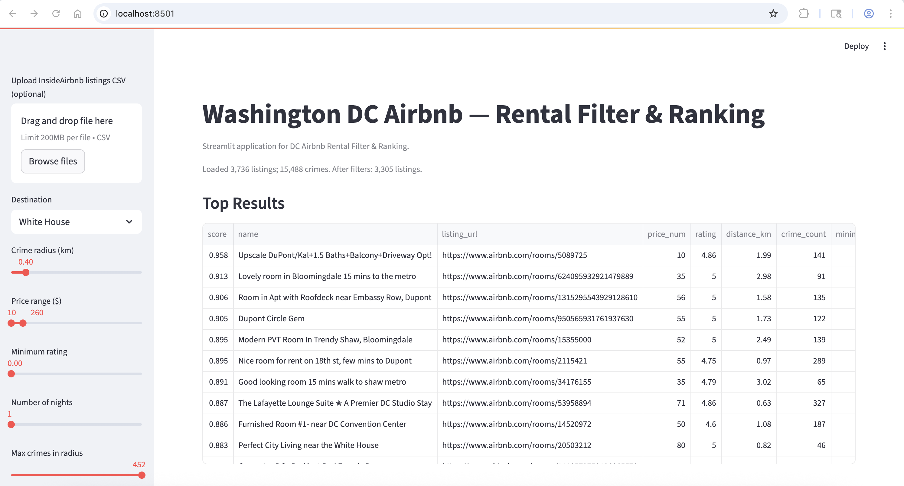
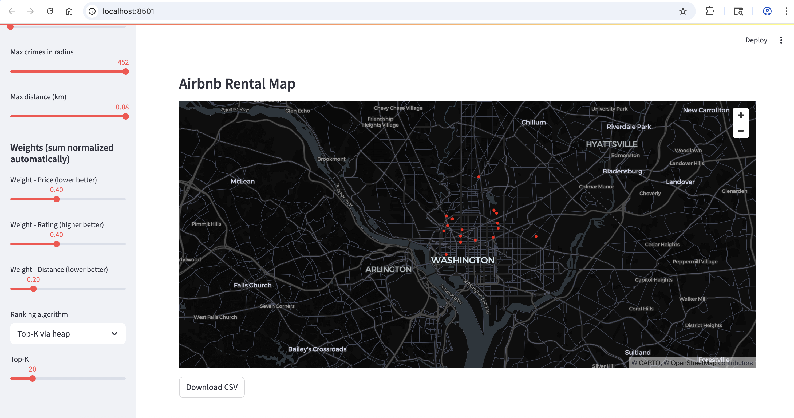
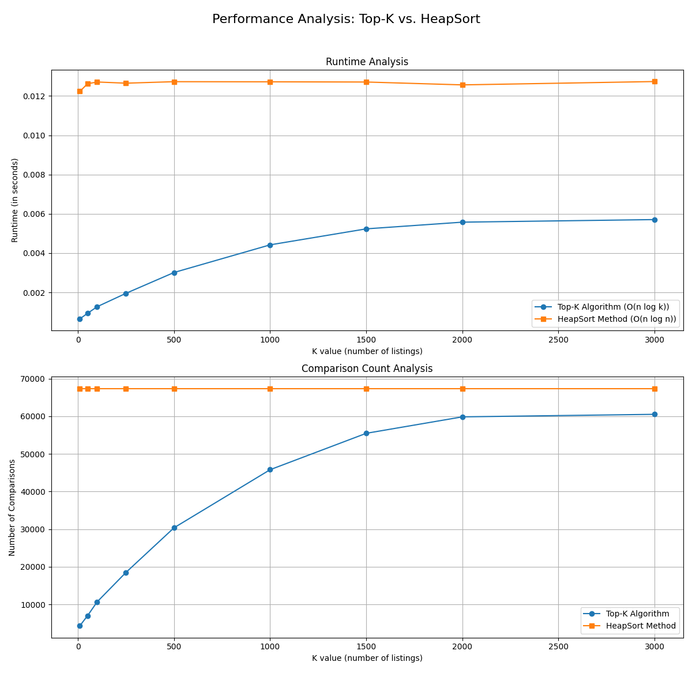

# MSML606 Final Project — DC Airbnb Rental Filter & Ranking

This is project explore Washington DC Airbnb listings, filter by price/rating/distance and neighborhood safety, and rank results using a simple weighted score. The app runs locally with Streamlit to help visualize the data and results.

## What it does
- Uses DC listings and crimes data (CSV)
- Choose a destination (e.g., White House)
- Filter by price, rating, and max distance
- Adjust weights for price/rating/distance to rank listings
- Choose a simple algorithm for ranking:
  - **Top-K** (uses min-heap data structure)
  - **HeapSort** (descending by score)
- View results on a table and a map, download the CSV

Notes:
- Distance is computed locally via haversine (straight-line). The haversine formula calculates the distance between two points given a latitude and longitude.
- Expected columns in CSV: `id,name,latitude,longitude,price,rating` (or `review_scores_rating` in 0–100, which will be converted to 0–5).

If present, the app will automatically use `data/dc-listings.csv` and `data/dc-crimes.csv`:
- `dc-listings.csv`: InsideAirbnb full export (large). The app extracts only needed columns.
- `dc-crimes.csv`: Must include `LATITUDE` and `LONGITUDE` (or lowercase). Crimes near each listing are counted within a selectable radius using a simple array data structure (vectorized haversine).

## Project structure
```
msml606-final-project/
  app.py                  # Streamlit app (entry point)
  requirements.txt        # dependencies to run application
  data/
    dc-listings.csv       # InsideAirbnb DC dataset
    dc-crimes.csv         # DC crimes dataset
  src/
    __init__.py
    utils.py              # haversine + normalization
    scoring.py            # weighted score computation
    data/
      __init__.py
      loader.py           # reads and cleans CSV
    features/
      safety.py           # vectorized crime counts within radius
    algorithms/
      __init__.py
      heap_topk.py        # Top-K using a min-heap
      sorting.py          # HeapSort
    performance/
      analysis.py         # run performance analysis on DC listing dataset
    pictures/
      Table.png           # Table visual from Streamlit UI
      Map.png             # DC Map visual from Streamlit UI
```

## Setup
1) Python 3.9+ recommended

2) Create and activate a virtual environment

On macOS/Linux run the following:
```
python3 -m venv .venv
source .venv/bin/activate
```

If on Windows (PowerShell), please run:
```
py -3 -m venv .venv
.venv\Scripts\activate
```

To deactivate later:
```
deactivate
```

3) Install dependencies
```
pip install --upgrade pip
pip install -r requirements.txt
```

## Run the app
```
streamlit run app.py
```

Then open the URL printed in your terminal (usually `http://localhost:8501`).

## Using your own data
- Download InsideAirbnb DC listings and export a CSV with at least:
  - `id, name, latitude, longitude, price, rating`
  - Or `review_scores_rating` (0–100) instead of `rating`
- Place it at `data/dc-listings.csv` (preferred) or upload via the sidebar in the app.
- Crime CSV at `data/dc-crimes.csv` should include `LATITUDE` and `LONGITUDE`.

## Example run
- Activate your virtual environment and install requirements (see Setup), then run:
```
streamlit run app.py
```
- In the sidebar:
  - Destination: White House
  - Crime radius (km): 0.5
  - Minimum rating: 4.0
  - Price range: leave default, or narrow as desired
  - Max crimes in radius: increase if you see no results
  - Max distance (km): start wide, tighten later
  - Weights: Price 0.4, Rating 0.4, Distance 0.2
  - Ranking algorithm: Top-K via heap, Top-K = 20 (or use HeapSort to rank all)

## Example Output




## Analysis
You can analyze how the two algorithms perform using `analysis.py` found inside of `src/performance`. Running this will generate two plots stored inside of `performance`; one for the runtime and another for the number of comparisons of Top-K vs Heapsort. Below is from an example run:


